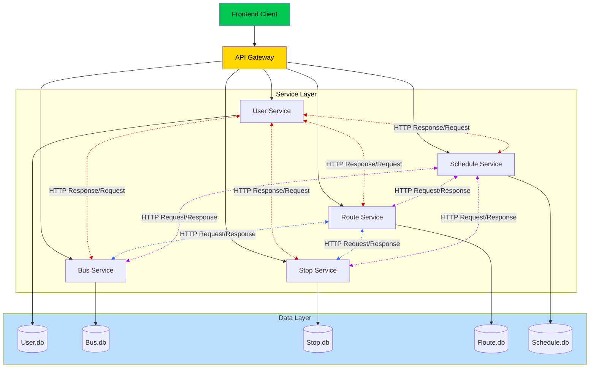

# **Public Transportation Tracker Microservices**

## 📌 Deskripsi Proyek

**Public Transportation Tracker Microservices** adalah sebuah sistem perangkat lunak yang dirancang untuk melacak dan mengelola layanan transportasi publik, khususnya bus. Proyek ini dibangun menggunakan arsitektur *microservices*, di mana fungsionalitas inti dipecah menjadi beberapa layanan (services) yang independen namun saling terhubung.

Tujuan utama dari proyek ini adalah untuk menyediakan platform yang memungkinkan pengguna umum melacak bus, melihat jadwal, dan mendapatkan estimasi waktu kedatangan (ETA). Di sisi lain, sistem ini juga menyediakan serangkaian *endpoint* khusus untuk administrator guna mengelola data master operasional, seperti mendaftarkan bus baru, membuat rute, dan mengatur jadwal.

Arsitektur sistem ini terdiri dari beberapa komponen utama:
* **User Service:** Menangani semua hal terkait autentikasi dan manajemen pengguna, seperti registrasi dan login.
* **Bus Service:** Mengelola data bus, termasuk penugasan rute dan pembaruan lokasi.
* **Route Service:** Mengelola informasi rute, termasuk daftar halte (stops) yang ada di dalam setiap rute.
* **Stop Service:** Bertindak sebagai layanan data master untuk semua informasi halte.
* **Schedule Service:** Mengelola jadwal keberangkatan bus dan menyediakan fungsionalitas inti untuk menghitung ETA.
* **API Gateway:** Berfungsi sebagai pintu masuk tunggal yang mengarahkan semua permintaan dari klien (Frontend) ke *service* yang sesuai.

Proyek ini dirancang untuk dijalankan dan dikelola menggunakan **Docker Desktop** dan **Docker Compose**, yang menyederhanakan proses instalasi dan *deployment* semua layanan secara bersamaan.

---

## 🏗️ **Arsitektur Sistem**

---
## 🚀 **Cara Menjalankan Proyek**

### **1. Clone Repository**

```bash
git clone https://github.com/AAkmalAmran/Project-UTS-IAE-Kelompok-1.git
```

### **2. Konfigurasi File ENV**

> a. Copy dan Paste file .env.example di setiap service
> 
> b. Rename file menjadi .env
> 
> c. Ubah SECRET_KEY, JWT_SECRET, JWT_SECRET_KEY 
>
> d. Patikan JWT_SECRET_KEY di api-gateway sama dengan JWT_SECRET_KEY di service-user

### **3. Install Docker Desktop**
> a. Link download: https://www.docker.com/products/docker-desktop/
> 
> b. Jalankan Docker Desktop

### **4. Jalankan Semua Service**
> a. Buka terminal
> 
> b. Masuk ke path utama proyek
> 
> c. Jalankan command dibawah

```bash
# Menjalankan Aplikasi
docker-compose up --build -d

#Inisialisasi Database (init-db)
docker-compose run --rm service-user flask init-db
docker-compose run --rm service-1-route flask init-db
docker-compose run --rm service-2-stop flask init-db
docker-compose run --rm service-3-bus flask init-db
docker-compose run --rm service-4-schedule flask init-db

# Pengisian Data Awal (seed-db)
docker-compose run --rm service-user flask seed-admin
docker-compose run --rm service-1-route flask seed-routes
docker-compose run --rm service-2-stop flask seed-stops
docker-compose run --rm service-3-bus flask seed-buses
docker-compose run --rm service-4-schedule flask seed-schedules
```

### **5. Cek Apakah Proyek Sudah Berjalan di Docker Desktop**

### **6. Buka Browser dan Buka http://localhost:5000 untuk mengakses frontend** 
### **7. Username dan Password Admin**
```bash
username: admin
password: admin123
```

---

## 👥 **Anggota Kelompok & Peran**

| Nama             | NIM   | Peran                                    |
| ---------------- | ----- | ---------------------------------------- |
| **AHMAD AKMAL AMRAN** | 102022300010 | Membuat User Service, Bus Service, API Gateway, dan Dokumentasi API menggunakan Postman |
| **FIRDAUS AL HAMID** | 102022300403 | Membuat Route Service, dan Diagram Arsitektur Sistem |
| **ILHAM FAHMI** | 102022300223 | Membuat Stop Service dan keseluruhan Frontend |
| **JOSUA IMMANUEL NATANAEL PASARIBU** | 102022300271 | Diberikan tanggung jawab terhadap Schedule Service |

---

# 📚 **Ringkasan Endpoint**

## **Port Tiap Service**

| Service | Port                 | 
| ------ | ------------------------ | 
| API Gateway    | 5000 | 
| User Service    | 5001 | 
| Route Service    | 5002 |
| Stop Service    | 5003   | 
| Bus Service    | 5004    |
| Schedule Service    | 5005    | 

## **User Service**

| Method | Endpoint              | Deskripsi                   |
| ------ | --------------------- | --------------------------- |
| POST    | `/login`              | Autentikasi pengguna dan mengembalikan token.    |
| POST   | `/register `              | Mendaftarkan pengguna baru. |
| DELETE    | `/users/<int:user_id>`         | Menghapus akun pengguna.  |
| GET    | `/admin/users` | Cek semua pengguna sistem — **khusus Admin**. |
| GET    | `/verify-admin` | Verifikasi Admin — **khusus Admin**.|

---

## **Bus Service**

| Method | Endpoint              | Deskripsi        |
| ------ | --------------------- | ---------------- |
| GET    | `/buses`       | Daftar semua bus   |
| GET   | `/buses/<int:busId>` | Mengambil detail satu bus berdasarkan `busId`.     |
| PUT   | `/buses/<int:busId>/location`   | Mengupdate posisi GPS (latitude, longitude) dan kecepatan bus.       |
| GET    | `/routes/<int:routeId>/buses`  | Mengambil semua bus yang sedang terdaftar pada rute tertentu. |
| POST   | `/admin/buses/add` | Menambahkan bus baru ke database — **khusus Admin**.     |
| PUT   | `/admin/buses/<int:busId>/route/assign`   | Meng-assign bus ke suatu rute (menghubungkan bus dengan `route_id`) — **khusus Admin**.       |
| DELETE    | `/admin/buses/<int:busId>/route/unassign`  | Menghapus hubungan bus dengan rute (melepaskan bus dari rute) — **khusus Admin**. |

---

## **Route Service**

| Method | Endpoint | Deskripsi |
| ------- | ---------------------------- | ------------------------------ |
| GET | `/routes` | Mengambil semua rute **aktif**. |
| GET | `/routes/<int:routeId>` | Mengambil detail satu rute berdasarkan ID (termasuk daftar halte di dalamnya). |
| GET | `/routes/<int:routeId>/stops` | Mengambil daftar halte dalam rute tertentu, sesuai urutan. |
| GET | `/routes/search?query=<nama>` | Mencari rute berdasarkan nama atau deskripsi. |
| GET | `/admin/routes` | Menampilkan semua rute (termasuk non-aktif) — **khusus Admin**. |
| POST | `/admin/routes/add` | Menambahkan rute baru ke database (beserta daftar halte opsional) — **khusus Admin**. |
| PUT | `/admin/routes/<int:routeId>` | Memperbarui detail rute (nama, asal, tujuan, status aktif) — **khusus Admin**. |
| DELETE | `/admin/routes/<int:routeId>` | Menghapus rute dari database — **khusus Admin**. |
| POST | `/admin/routes/<int:routeId>/stops/add` | Menambahkan halte ke dalam rute tertentu — **khusus Admin**. |
| DELETE | `/admin/routes/<int:routeId>/stops/<int:routeStopId>` | Menghapus halte dari rute — **khusus Admin**. |
| GET | `/health` | Mengecek status service dan koneksi database. |

---

## **Stop Service**

| Method | Endpoint | Deskripsi |
| ------- | ---------------------------- | ------------------------------ |
| GET | `/` | Menampilkan halaman web utama (index.html). |
| GET | `/stops` | Mengambil daftar semua halte (public). |
| GET | `/stops/<int:stopId>` | Mengambil detail satu halte berdasarkan ID. |
| GET | `/stops/search?query=<nama>` | Mencari halte berdasarkan nama (case-insensitive). |
| GET | `/stops/nearby?lat=<lat>&lon=<lon>` | Menampilkan halte terdekat dari lokasi pengguna (sementara masih mengembalikan semua halte). |
| GET | `/admin/stops` | Melihat semua halte — **khusus Admin**. |
| POST | `/admin/stops/add` | Menambahkan halte baru — **khusus Admin**. |
| PUT | `/admin/stops/<int:stopId>` | Mengupdate informasi halte — **khusus Admin**. |
| DELETE | `/admin/stops/<int:stopId>` | Menghapus halte berdasarkan ID — **khusus Admin**. |
| GET | `/health` | Mengecek status kesehatan service dan koneksi database. |

---
## **Schedule Service**

| Method | Endpoint | Deskripsi |
| ------- | ---------------------------- | ------------------------------ |
| GET | `/` | Menampilkan halaman utama web (index.html). |
| GET | `/schedules` | Mengambil semua daftar jadwal keberangkatan bus. |
| GET | `/schedules/<int:routeId>` | Mengambil daftar jadwal keberangkatan bus untuk rute tertentu. |
| GET | `/eta?busId=<busId>&stopId=<stopId>` | Menghitung ETA (perkiraan waktu kedatangan) bus tertentu ke halte tertentu. |
| GET | `/stops/<int:stopId>/arrivals` | Mengambil daftar bus yang akan tiba di halte tertentu beserta ETA-nya. |
| GET | `/routes/<int:routeId>/next-departures` | Menampilkan 5 jadwal keberangkatan berikutnya untuk rute tertentu. |
| GET | `/health` | Mengecek status service dan koneksi database. |
| GET | `/admin/schedules` | Melihat semua jadwal bus yang ada di database — **khusus Admin**. |
| POST | `/admin/schedules/add` | Menambahkan jadwal baru ke database — **khusus Admin**. |
| PUT | `/admin/schedules/<int:scheduleId>` | Memperbarui data jadwal tertentu — **khusus Admin**. |
| DELETE | `/admin/schedules/<int:scheduleId>` | Menghapus jadwal berdasarkan ID — **khusus Admin**. |


---

## **API Gateway**

| Method | Endpoint                 | Diteruskan ke   |
| ------ | ------------------------ | --------------- |
| GET, POST, PUT, DELETE    | `/api/user/*`    | User Service    |
| GET, POST, PUT, DELETE    | `/api/route/*` | Route Service |
| GET, POST, PUT, DELETE    | `/api/stop/*`    | Stop Service    |
| GET, POST, PUT, DELETE    | `/api/bus/*`    | Bus Service    |
| GET, POST, PUT, DELETE    | `/api/schedule/*`    | Schedule Service    |

---

# 📄 **Dokumentasi API Lengkap**

Dokumentasi endpoint lengkap ada di folder:

```
docs/API documentation/
```
Isi:
* `Bus Service Postman`
* `Route Service Postman`
* `Schedule Service Postman`
* `Stop Service Postman`
* `User Service Postman`
* `Transport System API - Complete.postman_collection.json`

Diagram sistem lengkap ada di folder:
```
docs/architecture/
```
Isi:
* `architecture-diagram.png`

---
